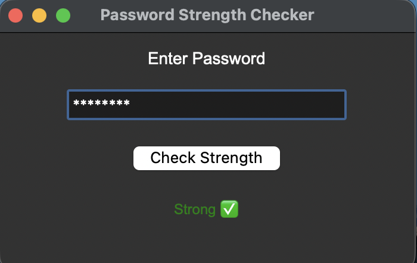
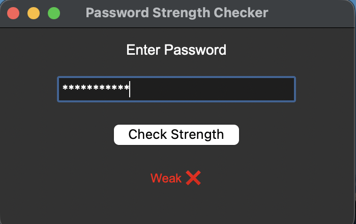

# 🔐 Password Strength Checker (GUI)

This project is a simple GUI-based password strength checker built using Python.  
It evaluates password strength based on length, uppercase/lowercase letters, numbers, and special characters.

---

## 🧠 Features

- GUI built using Tkinter
- Real-time password strength checking
- Color-based output:
  - Weak → Red
  - Medium → Yellow
  - Strong → Green
- Uses regex for pattern matching

---

## ⚙️ How it works

The program checks:
- Minimum length (8+ characters)
- Presence of uppercase letters
- Presence of lowercase letters
- Presence of digits
- Presence of special characters

Based on these conditions, it classifies password strength.

---

## 🖼️ Output Screenshot




---

## 💻 Code

```python
import re
import tkinter as tk

def check_strength():
    password = entry.get()
    strength = 0

    if len(password) >= 8:
        strength += 1
    if re.search("[a-z]", password):
        strength += 1
    if re.search("[A-Z]", password):
        strength += 1
    if re.search("[0-9]", password):
        strength += 1
    if re.search("[@#$%^&*]", password):
        strength += 1

    if strength <= 2:
        result_label.config(text="Weak ❌", fg="red")
    elif strength == 3:
        result_label.config(text="Medium ⚠️", fg="orange")
    else:
        result_label.config(text="Strong ✅", fg="green")

# Window setup
root = tk.Tk()
root.title("Password Strength Checker")
root.geometry("350x200")

# UI Elements
title = tk.Label(root, text="Enter Password", font=("Arial", 14))
title.pack(pady=10)

entry = tk.Entry(root, show="*", width=25)
entry.pack(pady=5)

check_btn = tk.Button(root, text="Check Strength", command=check_strength)
check_btn.pack(pady=10)

result_label = tk.Label(root, text="", font=("Arial", 12))
result_label.pack(pady=10)

root.mainloop() Paste your full Python code here
```

---

## 🛠️ Technologies Used

- Python
- Tkinter (GUI)
- re (Regular Expressions)

---

## 🚀 Future Improvements

- Add password suggestions
- Add strength meter (progress bar)
- Store password history (for learning purposes)
- Add dark/light theme toggle
- Convert into web app using Flask

---
